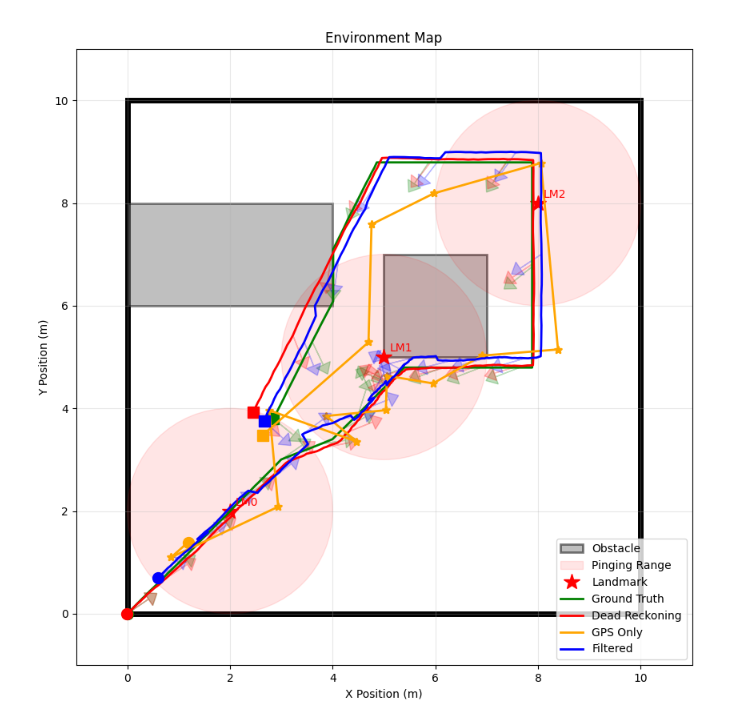
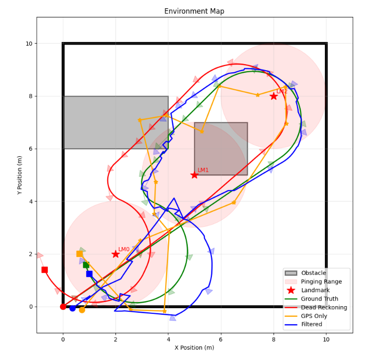
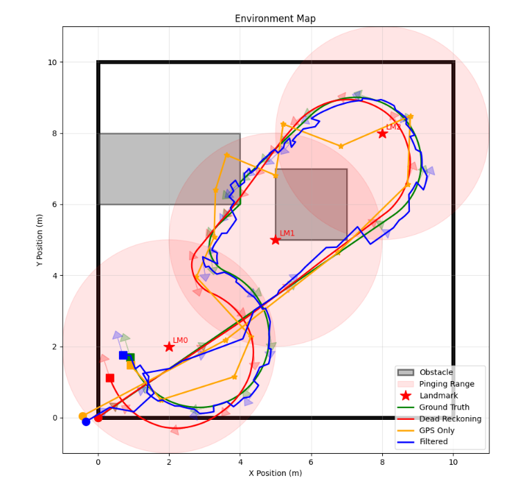
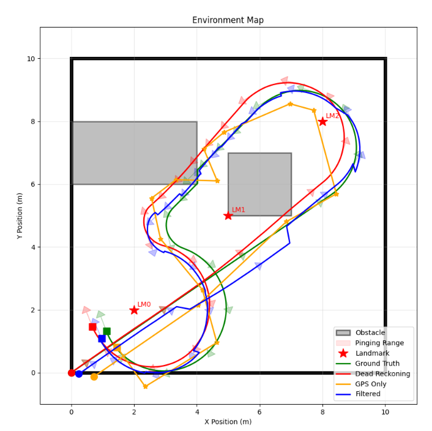
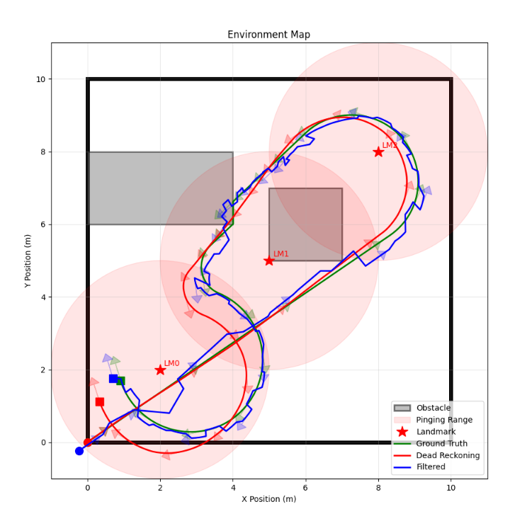
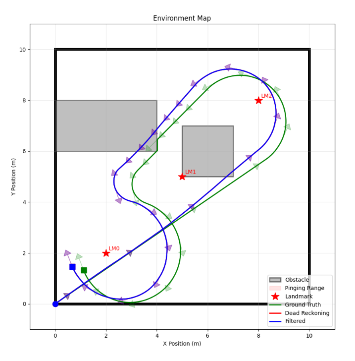

# Probabilistic Robotics Playground: 2D Mobile Robot Simulation Environment

> **Developed by [Mo]**
>
> **Contributors:** [Ivy Mahncke, Dominic Salmieri, Victoria Preston]

## Repository Overview and Vision

This repository is meant to be a starting point for creativity and self-guided learning for the _Probabilistic Robotics_ course at Olin College of Engineering, providing an initial skeleton for a mobile robot simulation environment. Assignments throughout the course will revisit this simulator: building out more of its capabilities, utilizing it to investigate particular algorithms and methods, and providing a start for deep dive projects that push the class materials even further.

## File Structure

```bash
├── src/
├── input/
├── output/
├── requirements.txt
├── README.md
├── simulator.md
```

`src` houses the source code for this project.

`input` houses example input files that configure the simulator.

`output` houses output files generated by the simulator.

### Running The Simulator

In input/config.yaml you can adjust the environment, robot, and sensor parameters. Create a virtual environment and download the dependencies from requirements.txt. Finally run python3 main.py from the src/ directory.

### Evaluating Linear and Extended Kalman Filters

In the src/ directory you will find implementations of a lkf and ekf in kalman_filter.py and extended_kalman_filter.py respectively. Below are some graphs of the filter output compared to dead reckoning and gps only state estimations as well as the ground truth.

<div align="center">
  
  <p><em>Linear Kalman Filter estimation</em></p>
</div>

When using the LKF, the robot is being controlled omnidirectionally. The LKF only uses odometry and GPS measurements, because the state is directly related to the odometry and GPS measurements. They have a linear relationship.

<div align="center">
  
  <p><em>Extended Kalman Filter estimation</em></p>
</div>

When using the EKF, the robot is being controlled with differential drive. The EKF uses odometry, GPS, and a landmark pinger. The relationship between the state with odometry and landmark pinger measurements is non-linear. Linear and angular velocity from odometry does not have a linear relationship because we are using differential drive and the landmark pinger returns the range and bearing of the robot to the landmark(s) in range which is not linearly related to robot position and heading.

From the visualizer we can see that when the robot is within pinging range of a landmark, the filters estimation is significantly closer to the ground truth, higher quality. However, even when within range of a landmark the estimation is not always spot on. The large turn in the bottom left, outside of pinging range is quite off. When the robot re-enters landmark 0, the filter is able to quickly correct even after the absence of a landmark. When the robot is in between the obstacles, it crashes into one. The dead reckoning is quite off from the ground truth, however the filter is able to mostly correct for the off odometry.

<div align="center">
  
  <p><em>Extended Kalman Filter estimation with larger pinging range</em></p>
</div>

By increasing the pinging range, the robot is always within range of atleast one landmark. This significantly increases the quality of the filter, with the estimations being quite close to ground truth despite noisy gps data.

<div align="center">
  
  <p><em>Extended Kalman Filter estimation with only GPS updates</em></p>
</div>

By removing landmark pinger measurements, the ekf performs okay with only GPS measurements. However, after crashing into the wall, it takes significantly longer for it to correct.

<div align="center">
  
  <p><em>Extended Kalman Filter estimation with only landmark pinger updates</em></p>
</div>

By removing GPS measurements, the ekf state estimations are slightly less accurate, but still high quality, and able to correct for crashing into the wall. I believe the landmark pinger measurements increase the quality of the EKF more than the GPS, because the GPS was configured with a lot of noise.

<div align="center">
  
  <p><em>Extended Kalman Filter estimation with no update step</em></p>
</div>

By removing GPS and landmark pinger measurements, removing the update step, the EKF estimation is just dead reckoning. It is unable to correct and significantly impacted by crashing into the wall.

While I was implementing the EKF I got stuck thinking that it wasn't working, but it was just that the estimations are always going to be somewhat off. The motion model and sensors will always have noise, if they didn't we wouldn't need filters, so the estimations won't be perfect. Since the filter involves linearizing the measurement and motion models to convert our state estimate into a measurement and to calculate process covariance, if the estimate is off from the ground truth, it can diverge more because of inaccurate linearization. I learned about innovation gating, a way of throwing out outlying sensor measurements to somewhat alleviate this. To get quality estimates, I had to tune the noise for the sensors and the motion model. Essentially conveying how much trust I had in each. For example adding more noise to the GPS than the landmark pinger because the GPS has noisier measurements. Ultimately the EKF performed well, estimation quality increased with more tuned sensors, lack of sensors and poor filter tunning can significantly decrease the filter's quality.
